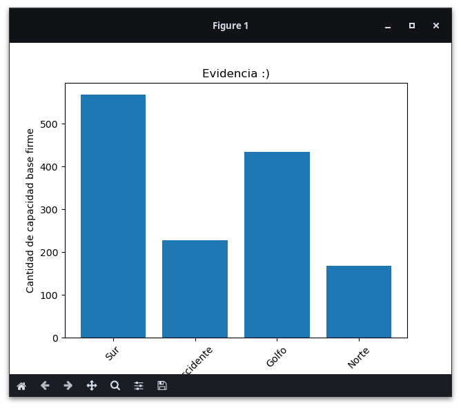

# Avance de la evidencia de Big Data

Trabajo realizado por **Cristian Santiago Matus Gutiérrez** (SaVa-dev).
Creado para la matería de Fundamentos de programación para Big Data.

## Instrucciones

Para esta evidencia, se pidió lo siguiente:

1. Realizar una base de datos tipo SQL y una query para crear una tabla.
2. Se tendría que llenar la tabla con los datos del archivo CSV *"Tarifas por puntos 2016-2017.csv"*.
3. Hacer una propuesta para visualizar las relaciones hechas en Python.

## Pasos realizado

### Parte SQL


Se pidió instalar una base de datos para poder manejar la información.
En mi caso, lo hice con una base de datos llamada *"XAMPP"*,

También se pidió crear una Query para poder crear la tabla.
Adicionalmente, también creé una Query para poder ingresar los datos a la tabla.
Todos estos archivos se encuentran en el archivo *"tabla.sql*


Una vez llenado el dataset, podemos continuar con la parte de python

-----

### Parte instalación de librerias de Python

Para poder modificar las tablas SQL a python, se instaló la libreria de `mysql.connector`.
Para instalarlo, se hace de la siguiente manera:

**Distribuciones Arch Linux (la mía)**
```bash
sudo pacman -S python-mysql-connector
```

**Python package manager (pip)**
```bash
pip install mysql-connector-python
```

Una vez instalado, también se necesitó de instalar la libreria `matplotlib`para mostrar gráficos en python.
Para instalarlo, se hace de la siguiente manera:

**Distribuciones Arch Linux (la mía)**
```bash
sudo pacman -S python-matplotlib
```

**Python package manager (pip)**
```bash
pip install matplotlib
```
-----

### Visualización de tablas

Para visualizar los datos, se usaron gráficas de barras gracias a su facilidad de mostrar datos, y se decidió relacionar la capacidad base firme total con su zona de inyeccion.

Al final el resultado fue el siguiente:



y es todo jaja (tengo sueño ;-;)